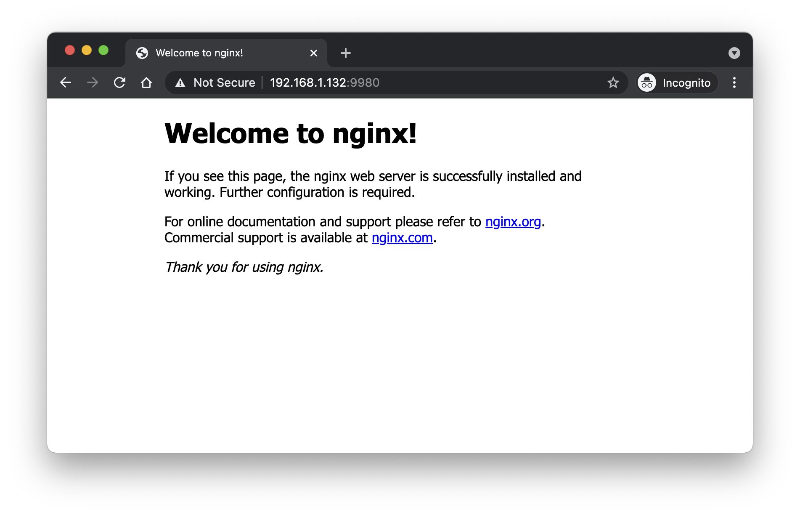

# How To Install Kubernetes Cluster with Kubeadm
Following steps reference link:https://kubernetes.io/docs/setup/production-environment/tools/kubeadm/install-kubeadm
## 0. Prepare Lab Environment with vagrant,follow steps by
https://github.com/supachai-j/kubernetes-for-beginners/blob/master/README.md

Lab Environemnt info: <br />
- Master 1 node<br />
- Woker   2 nodes<br />

## 1. Letting iptables see bridged traffic - (All Nodes)
### 1.1 Make sure that the br_netfilter module is loaded, All nodes.
```
$sudo modprobe br_netfilter
$lsmod | grep br_netfilter
```
### 1.2 As a requirement for your Linux Node's iptables to correctly see bridged traffic, All nodes.
```
$cat <<EOF | sudo tee /etc/sysctl.d/k8s.conf
net.bridge.bridge-nf-call-ip6tables = 1
net.bridge.bridge-nf-call-iptables = 1
EOF
$sudo sysctl --system
```
## 2. Install Runtime (Install docker on Ubuntu) - (All Nodes)
### 2.1 Setup the repository.
```
# Install packages to allow apt to use a repository over HTTPS.
$sudo apt-get update && sudo apt-get install \
    apt-transport-https \
    ca-certificates \
    curl \
    gnupg-agent \
    software-properties-common

# Add Docker's official GPG key:
$curl -fsSL https://download.docker.com/linux/ubuntu/gpg | sudo apt-key add -

# Add the Docker apt repository:
$sudo add-apt-repository \
   "deb [arch=amd64] https://download.docker.com/linux/ubuntu \
   $(lsb_release -cs) \
   stable"
```

### 2.2 Install Docker CE
```
# Apt update and install docker
$sudo apt-get update && sudo apt-get install -y \
  containerd.io=1.2.13-2 \
  docker-ce=5:19.03.11~3-0~ubuntu-$(lsb_release -cs) \
  docker-ce-cli=5:19.03.11~3-0~ubuntu-$(lsb_release -cs) \
  --allow-downgrades
  
# Set up the Docker daemon
$cat <<EOF | sudo tee /etc/docker/daemon.json
{
  "exec-opts": ["native.cgroupdriver=systemd"],
  "log-driver": "json-file",
  "log-opts": {
    "max-size": "100m"
  },
  "storage-driver": "overlay2"
}
EOF

# Create /etc/systemd/system/docker.service.d
$sudo mkdir -p /etc/systemd/system/docker.service.d

# Restart Docker
$sudo systemctl daemon-reload
$sudo systemctl restart docker

# Eanble Docker
$sudo systemctl enable docker
```
## 3. Installing kubeadm, kubelet and kubectl - (All Nodes)

```
sudo apt-get update && sudo apt-get install -y apt-transport-https curl
curl -s https://packages.cloud.google.com/apt/doc/apt-key.gpg | sudo apt-key add -
cat <<EOF | sudo tee /etc/apt/sources.list.d/kubernetes.list
deb
https://apt.kubernetes.io/ kubernetes-xenial main
EOF
sudo apt-get update
sudo apt-get install -y kubelet kubeadm kubectl
sudo apt-mark hold kubelet kubeadm kubectl
```
## 4. Creating a cluster with kubeadm
### 4.1 Initializing your control-plane node - (Master Node Only)
```
kubeadm init --pod-network-cidr 10.224.0.0/16 --apiserver-advertise-address=192.168.56.2
```
To make kubectl work for your non-root user, run these commands, which are also part of the kubeadm init output:
```
mkdir -p $HOME/.kube
sudo cp -i /etc/kubernetes/admin.conf $HOME/.kube/config
sudo chown $(id -u):$(id -g) $HOME/.kube/config
```
### 4.2 Installing a Pod network add-on (Weave net) - (Master Node Only)
Weave Net can be installed onto your CNI-enabled Kubernetes cluster with a single command:
```
kubectl apply -f "https://cloud.weave.works/k8s/net?k8s-version=$(kubectl version | base64 | tr -d '\n')"
```
Check master node is ready.
```
kubemaster $ kubectl get node
NAME         STATUS   ROLES    AGE   VERSION
kubemaster   Ready    master   13m   v1.19.3
kubemaster $
```
### 4.3 Joining your nodes, Login to worker nodes and run command that was output by kubeadm init. (Refer output from 4.1) - (All Worker Nodes)

```
kubeadm join 192.168.56.2:6443 --token XXXXXX.XXXXXXXXXX \
    --discovery-token-ca-cert-hash sha256:YYYYYYYYYYYZZZZZZZZZZZZZZZZZZZ
```
If you want to get command join worker on master node, run command.
```
kubeadm token create --print-join-command
```
Run command on the Master node to see woker nodes join the cluster.
```
kubemaster $ kubectl get nodes
NAME         STATUS   ROLES    AGE    VERSION
kubemaster   Ready    master   21m    v1.19.3
kubenode01   Ready    <none>   2m3s   v1.19.3
kubenode02   Ready    <none>   115s   v1.19.3
kubemaster $
```
### 4.4 Testing create/delete pod on k8s cluster.
Creating pod name is nginx and image nginx.
```
kubemaster $ kubectl run nginx --image=nginx
pod/nginx created
kubemaster $
```
List pod on k8s cluster.
```
kubemaster $ kubectl get pod -o wide
NAME    READY   STATUS    RESTARTS   AGE     IP          NODE         NOMINATED NODE   READINESS GATES
nginx   1/1     Running   0          2m16s   10.44.0.1   kubenode01   <none>           <none>
kubemaster $
```

Testing expose service in container to external network.
```
kubectl port-forward --address 0.0.0.0 pod/nginx 9980:80
``` 
Try browsing http://ip-address-k8s:9980 and see  


Press Ctrl + C, if you have stop it.

Detele pod nginx on k8s cluster.
```
kubemaster $ kubectl delete pod nginx
pod "nginx" deleted
kubemaster $
```
Installation and testing is completed. Thanks 